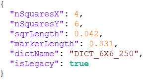
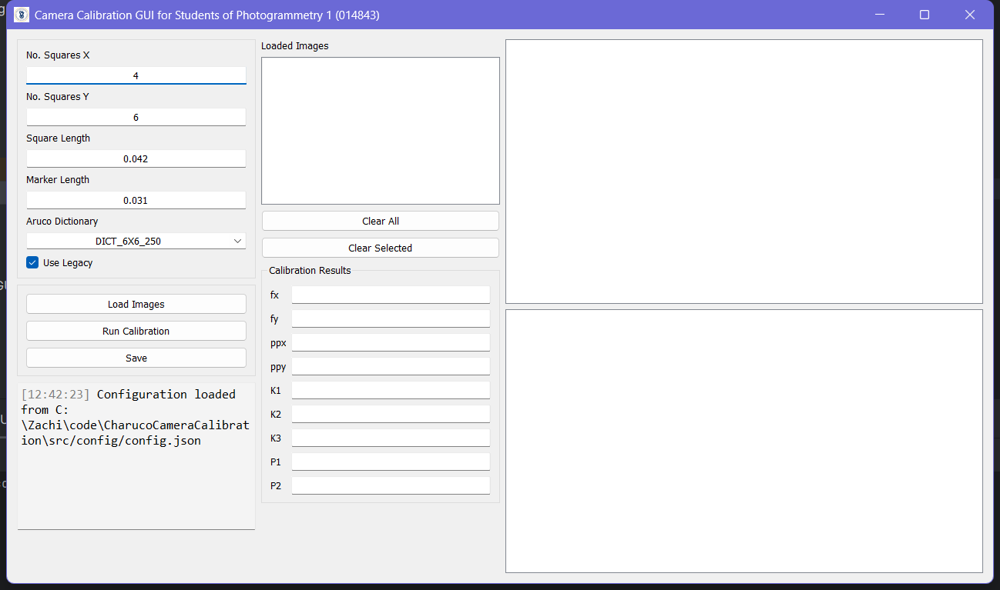
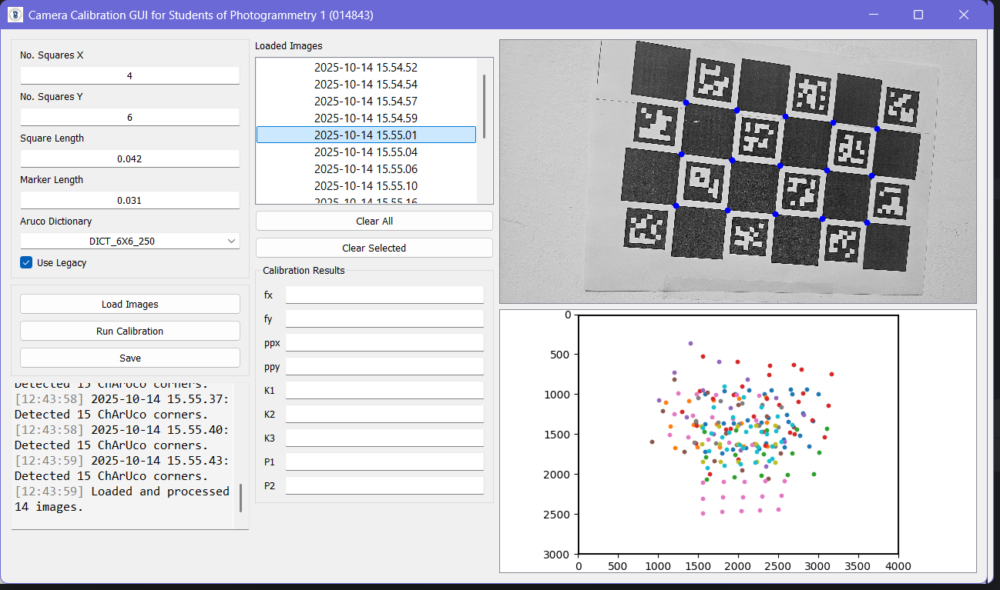
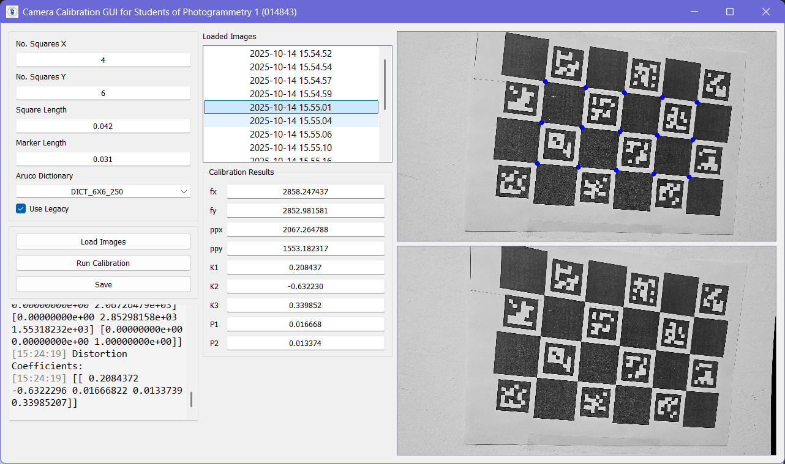

<p align="center">
  
</p>

<h1 align="center">Charuco Camera Calibration</h1>

<p align="center">
  
  
  
  
</p>

<p align="center">
  A GUI tool for camera intrinsic calibration using ChArUco boards, built with OpenCV and PyQt5.
</p>

---

## 📋 Table of Contents

- [✨ Features](#-features)
- [🗂 Project Structure](#-project-structure)
- [⚙️ Installation](#️-installation)
- [🚀 Usage](#-usage)
- [📄 License](#-license)

---

## ✨ Features

- 📐 Camera intrinsic calibration via ChArUco boards (OpenCV)
- 🖥️ PyQt5 GUI with live corner visualization
- 🏗️ MVC architecture (Model / View / Controller)
- 📊 Scatter plot of detected corners across all loaded images
- 🔧 JSON config file for repeatable board setups
- 📝 Auto-saved session log on close

---

## 🗂 Project Structure

```
src/
  main.py                  — entry point
  CalibrationModel.py      — data, OpenCV calibration logic, Qt signals
  CalibrationView.py       — all Qt widgets and display methods
  CalibrationController.py — orchestration, input validation, rendering
  config/
    config.json            — default board parameters
  logs/                    — session logs (auto-saved on close)
```

---

## ⚙️ Installation

<details>
<summary><b>Show installation steps</b></summary>

### 1. Create a virtual environment

```bash
python -m venv CamCalib
```

### 2. Activate the virtual environment

On **Windows**:

```bash
.\CamCalib\Scripts\activate
```

### 3. Upgrade `pip`

```bash
.\CamCalib\Scripts\python -m pip install --upgrade pip
```

### 4. Install dependencies

```bash
.\CamCalib\Scripts\pip install numpy matplotlib pyqt5 opencv-contrib-python
```

Or install from `requirements.txt`:

```bash
.\CamCalib\Scripts\pip install -r requirements.txt
```

</details>

---

## 🚀 Usage

### ⚙️ 1. Configuration

Before launching the application, make sure your images with the ChArUco board are ready.
It is best to use **at least eight images** for a reliable calibration.

If the calibration process is to be repeated multiple times with the same ChArUco board, its properties can be set via `src/config/config.json`:

| Parameter | Type | Default | Description |
|-----------|------|---------|-------------|
| `nSquaresX` | `int` | `4` | Number of chessboard squares along X |
| `nSquaresY` | `int` | `6` | Number of chessboard squares along Y |
| `sqrLength` | `float` | `0.042` | Side length of a chessboard square (meters) |
| `markerLength` | `float` | `0.031` | Side length of an ArUco marker (meters) |
| `dictName` | `string` | `DICT_6X6_250` | ArUco dictionary name |
| `isLegacy` | `bool` | `true` | Set `true` for boards made with OpenCV < 4.6.0 |



> For boards generated using older versions of OpenCV (before 4.6.0), make sure to set `isLegacy` to `true`.

### 🚀 2. Launching the application

```bash
.\CamCalib\Scripts\python .\src\main.py
```

The application will open with the values from `config.json` pre-loaded into the left panel.



### ✅ 3. Verify board configuration

If the config was not edited before launching, modify the board properties directly in the left panel before proceeding.

### 📂 4. Loading the images

Click **Load Images** and select the images to use. The application will:

1. Load and convert each image to grayscale
2. Detect ArUco markers in each image
3. Interpolate ChArUco board corners from the detected markers
4. Add each processed image name to the list in the middle panel
5. Display a scatter plot of all detected corners in the right panel

The corners are bounded by a black rectangle representing the image boundary.
For reliable results, the detected corners should cover the **majority of the camera's field of view**.

> **Note:** At least four corners must be detected per image; images below this threshold are excluded from calibration.

Clicking an image name in the list will show the image with its detected corners overlaid as blue circles.



To remove an image with insufficient corners, select it and click **Clear Selected**.

### 📐 5. Calibration

Click **Run Calibration** to start the computation. If successful:

- The intrinsic parameters and distortion coefficients are filled into the results panel
- Selecting an image from the list now shows its undistorted version in the right panel



Click **Save** to export the calibration as `calibration.json` in the same folder as the loaded images. The file includes:

- Camera intrinsics (focal lengths and principal point)
- Radial distortion coefficients (k1, k2, k3)
- Tangential distortion coefficients (p1, p2)
- Overall reprojection RMS error and number of images used
- Detected corner coordinates per image

> When the window is closed, a log file is automatically saved to `src/logs/`.

---

## 📄 License

This project is licensed under the MIT License. See the [LICENSE](LICENSE) file for details.
