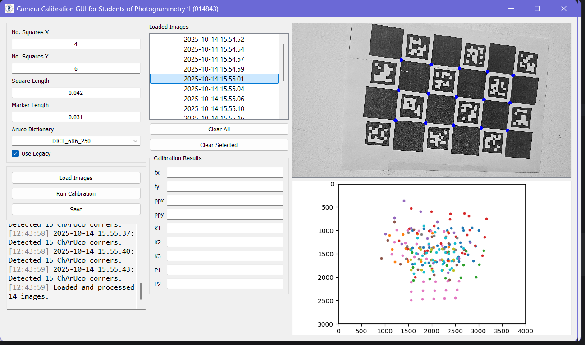
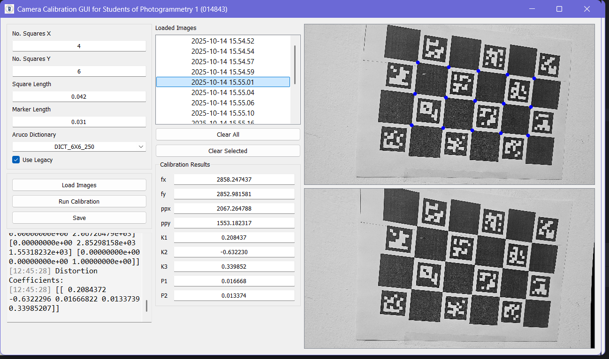

# Charuco Camera Calibration

A Python-based camera calibration tool that uses OpenCV and PyQt5 to provide a graphical interface for calibrating cameras with Charuco boards.


## Features

- Camera calibration using OpenCV
- GUI built with PyQt5
- Visualization of calibration results
- Easy setup with Python virtual environment

## Installation

Follow these steps to set up the project:

### 1. Create a virtual environment

```bash
python -m venv CamCalib
```

### 2. Activate the virtual environment

On **Windows**:

```bash
.\CamCalib\Scripts\activate
```

### 3. Upgrade `pip`

```bash
.\CamCalib\Scripts\python -m pip install --upgrade pip
```

### 4. Install dependencies

```bash
.\CamCalib\Scripts\pip install numpy matplotlib pyqt5 opencv-contrib-python
```
Or install from requirements.txt file
```bash
.\CamCalib\Scripts\pip install -r requirements.txt
```

## Usage

### 1. Configuration

Before launching the calibration application, make sure your images with the charuco board are ready.
The number of images required varies depending on the Charuco board used.
It is best to use **a minimal number of eight images** for a reliable calibration.

If the calibration process is to be repeated multiple times with the same Charuco board, its properties can be set via the `config.json` file.


For boards generated using older versions of OpenCV, specifically before version 4.6.0, make sure to set the `isLegacy` field to `True`.

### 2. Launching the application

After completing the installation and configuration, run the main application script:

```bash
.\CamCalib\Scripts\python .\src\cameraCalibrationGUI.py
```

The application will appear with the values from the `config.json` loaded into the top-left panel of the window.


### 3. Verify board configuration

If the configurations json was not editted before running the application, modify the respective properties of the Charuco board.

### 4. Loading the images

Once the board configurations are set correctly, click the "Load Images" button. 
After selecting the images to be used, they will be loaded and converted to grayscale.
Then, the application will detect the Charuco markers in each image, and if successfuly will proceed to detect the board corners.
When processing an image is done, its name will be added to the listbox in the middle.
Finally, a scatter plot of all detected corners in all images will appear in the bottom-right part of the window.
The corners will be bounded by a black rectangle, representing the image boundary.
For reliable calibration results, it is best that the detected corners cover the majority of the camera's field of view.

**Note**: At least four corners should be detected per image; otherwise, the calibration will fail.

Selecting an image name from the listbox will show the image with its detected corners as blue circles.



To remove an image that does not meet the required number of detected corners, click the "Clear Selected" button.

### 5. Calibration

Clicking the "Run Calibration" will begin the computation process. 

If successful, the calibrated values will be filled in the respective textboxes, and
Selecting an image from the listbox will now show its undistorted version instead of the corner scatter plot.



Clicking on the "Save" button will save the calibration inforamtion as a json file in the same path of the loaded images.
The resulting json file will include:
- The camera intrinsics (the focal lengths and principal point),
- The radial (k1, k2, k3) and tangential (p1, p2) lens distortion coefficients,
- The overall reprojection RMS error and number of images participating in the calibration process,
- The coordinates of the detected corners in each image.

When closing the calibration window, a log file will be created under a subfolder named `logs` next to the application script.
The saved logf file witll contain all the printed information from the logging textbox.


## License

This project is licensed under the MIT License. See the [LICENSE](LICENSE) file for details.
